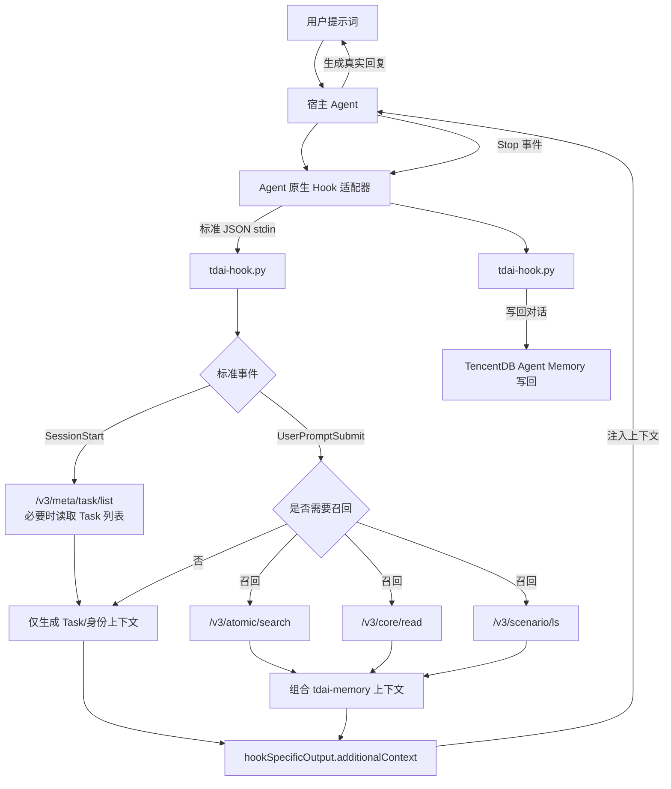

# Agent 与 TencentDB Agent Memory 交互说明

这份文档说明 Hook 安装完成后，Agent 如何真正和 TencentDB Agent Memory
交互。Hook 是旁路适配器：它不代理模型请求、不替换 Agent 的登录，也不改变
Agent 原来的模型 endpoint。

## 一、完整数据流



用一句话概括：

```text
原生事件 → 原生适配器 → 标准 JSON → tdai-hook.py → Memory API
         ← 原生响应 ← additionalContext ← 标准核心 ←
```

Agent 仍然负责回答用户；Hook 只负责在回答前提供上下文、在一轮结束后保存
真实对话。

## 二、三类事件怎样工作

| 事件 | Hook 行为 | Memory API | 回给 Agent 的内容 |
| --- | --- | --- | --- |
| `SessionStart` | 读取本机会话状态；没有绑定且要求选 Task 时列出可选 Task | `/v3/meta/task/list`（仅在需要时） | `<tdai-task-selection>` 或 `<tdai-task-binding>` |
| `UserPromptSubmit` | 处理 Task 命令；判断是否召回；保存当前 prompt 到会话状态 | 触发召回时调用 `/v3/atomic/search`、`/v3/core/read`、`/v3/scenario/ls` | `<tdai-task-binding>`、可选 `<tdai-memory>` |
| `Stop` | 读取本轮真实 prompt 和真实 assistant message，写回对话 | `/v3/conversation/add` | 通常为空；不阻塞回复 |

所有请求都会携带配置中的 `team_id`、`agent_id`、`user_id`；绑定 Task 时再带
`task_id`，保存对话时带 `session_id`。认证密钥只放在用户私有配置和请求头中，
不会进入提示词、Hook 输出或 Git 仓库。

## 三、什么时候会召回 Memory

普通 Coding Prompt 默认不查询 Memory。例如：

```text
用 Python 写一个函数判断整数是否为偶数。
```

这类请求会记录 `recall_decision enabled=false`，通常对应 `memory=0`；Agent
仍可能收到当前 Task/身份绑定上下文。

以下两种情况会查询 Memory：

1. 用户提示包含配置的历史关键词，例如“上次”“之前”“偏好”“历史结论”、
   `previous`、`remember` 等；
2. 用户显式强制召回：

   ```text
   /tdai-recall 请找出之前关于相机标定参数的决定
   ```

   也支持 `@recall <query>`。召回结果会被限制长度并放入
   `<tdai-memory>...</tdai-memory>`，再由适配器注入当前 Agent。

召回内容是参考上下文，不是对当前用户指令的替代；当前用户指令与历史内容
冲突时，以当前用户指令为准。

## 四、Task 绑定与跨 Task 读取

模板默认将 `require_task_selection` 设为 `false`，新会话会立即使用 Agent 级别
绑定，从而不会因为首次 Task 选择而跳过第一轮 L0 写回。它不会凭空选择某个具名
Task；需要具名 Task 时，请使用下面的命令或把配置设为 `true`。

如果配置启用了 `require_task_selection=true`，新会话首次会收到 Task 选择提示，
第一条业务请求会暂存，直到用户完成选择。这是严格隔离模式的预期行为，不是网络
故障。用户可以回复：

```text
保持                 # 沿用上次绑定
1                    # 选择列表中的序号
任务名称或 task_id    # 按名称或 ID 选择
0                    # 不绑定 Task，读取当前 Agent 的全部 L0/L1
```

运行中的会话还支持：

```text
/tdai-task list
/tdai-task current
/tdai-task switch
@task <任务名称或 task_id>
```

`@task` 后可换行继续写原始请求。切换或查看命令只改变/查看绑定，不应被当成
实际业务请求写入 Memory。

## 五、Stop 如何写回

目标 Agent 的原生 Stop Hook 必须把真实的最近一条用户 prompt 和真实的
assistant message 映射到标准字段：

```json
{
  "hook_event_name": "Stop",
  "session_id": "session-123",
  "prompt": "用户本轮真实请求",
  "last_assistant_message": "Agent 本轮真实回复",
  "client": "<agent-name>"
}
```

核心随后调用 `/v3/conversation/add`。如果缺少任一真实消息、捕获被关闭、当前
没有 Task/Agent 绑定，或后端不可达，Hook 只记录日志并跳过写回，不伪造内容，
也不阻塞 Agent。

## 六、适配器必须做什么

每个 Agent 自己生成的原生 Hook 只做四件事：

1. 把原生事件名映射为 `SessionStart`、`UserPromptSubmit`、`Stop`；
2. 映射 `session_id`、`prompt`、`last_assistant_message`、`cwd`、`client`；
3. 调用 `tdai-hook.py`，提取 `hookSpecificOutput.additionalContext` 并注入原生
   prompt；
4. 在 Stop 事件传入真实 assistant message，所有异常都 fail-open。

适配器不能复制召回/写回逻辑，不能把 Memory endpoint 当成模型 endpoint，也不能
把 Agent 专用配置路径和密钥写进标准核心。

### Windows 路径传递

宿主只接受 command 字符串时，使用安装后的实际绝对路径和正斜杠，例如：

```text
py -3 C:/Users/<user>/.tdai-hook/adapters/<agent>-hook.py
```

不要把 `"%USERPROFILE%\\..."` 再嵌套进 JSON command 字符串；这会让 Windows
`cmd /c` 把引号当成路径内容。宿主支持 argv 时，优先传递
`["py", "-3", "C:/.../<agent>-hook.py"]`。适配器应根据自身文件位置解析标准
核心，不能硬编码某台机器的用户名、路径或 Task ID。

### 多轮工具调用下的 Stop 回退

有些宿主在 Stop 事件中不直接提供最终回复，或只提供执行编号。适配器应按以下
顺序提取数据：

1. 优先读取 Stop payload 的真实 `prompt` 和 `last_assistant_message` 字段；
2. 字段缺失时，从宿主提供的 transcript 路径倒序寻找最近一条真实用户消息和
   最终模型文本；
3. 再使用标准协议列出的字段别名作为回退；
4. 仍找不到真实的一对消息时，跳过写回并记录原因，绝不能把工具日志、Hook
   输出或占位文本当成 assistant message。

核心也会在会话状态缺失时回退到最近绑定，并从 Stop 事件补取 prompt；适配器仍
必须尽可能提供真实 transcript，才能保证 L0 完整。

## 七、可直接复制的提示词

### 1. 一句话安装提示词

这是对任何支持自定义 Hook 的 Agent 发送的最小提示词；其余步骤由仓库内文档
驱动：

```text
请根据 GitHub 仓库地址安装 TDAI Standard Hook
https://github.com/mercuryLiu163/tdai-standard-hook
```

### 2. 让 Agent 生成自己的原生 Hook

安装完成后，把下面提示词发给目标 Agent（将 `<agent-name>` 换成它自己的名称）：

```text
TDAI Standard Hook 已安装。请先读取仓库中的
AGENT_INSTALL.md、docs/MEMORY_INTERACTION.md、protocol/tdai-hook-v1.md 和
adapters/README.md，再根据你当前版本的原生 Hook 文档生成并启用一个薄适配器。

要求：
1. SessionStart、UserPromptSubmit、Stop 都映射到标准 JSON 事件；
2. client 固定为 <agent-name>，session_id 必须稳定；
3. UserPromptSubmit 注入 tdai-hook.py 返回的
   hookSpecificOutput.additionalContext；
4. Stop 必须传入真实的用户 prompt 和真实的 assistant message；
5. 只做字段映射、调用和响应格式转换，不复制 Memory 业务逻辑；
6. 不修改模型 endpoint、模型选择、登录方式或无关权限配置；
7. 完成后用一个普通 Prompt、一个 /tdai-recall Prompt 和一次 Stop 做验证，
   报告实际 Hook 配置路径和验证结果。
```

### 3. 手动验证交互

```text
普通测试：用 Python 写一个函数判断整数是否为偶数。
强制召回：/tdai-recall 请找出之前关于这个项目测试策略的结论。
Task 查看：/tdai-task current
Task 列表：/tdai-task list
切换 Task：/tdai-task switch
```

验证时应观察：普通测试没有 Memory 查询；强制召回出现 `<tdai-memory>`；一轮
正常回答结束后 Stop 日志出现 `captured` 或明确的 `skip_capture` 原因。

### 4. 让 Agent 做一次完整验收

```text
请验收当前 TDAI Standard Hook 与 TencentDB Agent Memory 的真实交互，不修改代码
或配置：
1. 发送一个无历史需求的普通 Coding Prompt；
2. 发送一次 /tdai-recall；
3. 完成一轮正常回答并触发 Stop；
4. 检查 hook.log/hook.jsonl 中的 recall_decision、injected_chars、captured 或
   skip_capture；
5. 报告 Task/Agent 绑定、召回字符数、写回结果和任何 fail-open 原因。
```

## 八、故障判断

| 现象 | 优先检查 |
| --- | --- |
| 没有任何上下文 | 原生 Hook 是否真的调用核心；stdin 是否为标准 JSON；`TDAI_CONFIG`/`TDAI_PROFILE` 是否正确 |
| `memory=0` | 是否只是普通 Prompt；用 `/tdai-recall <query>` 区分“未触发”与“后端无结果” |
| 只有绑定没有记忆 | 召回接口无命中，或 Task/Agent 隔离范围不匹配 |
| 没有 `captured` | Stop 未传真实 assistant message、捕获被关闭、未绑定，或只触发了控制命令 |
| 后端不可达 | 检查 `hook.log` 的失败原因；这是 fail-open，Agent 仍应继续工作 |

`injected_chars` 会记录 `binding`、`memory`、`capability`、`total` 字段，可用
`total / 4` 对注入 token 做粗略估算；它只统计 Hook 注入上下文，不等于宿主最终
账单中的全部 input/output token。
